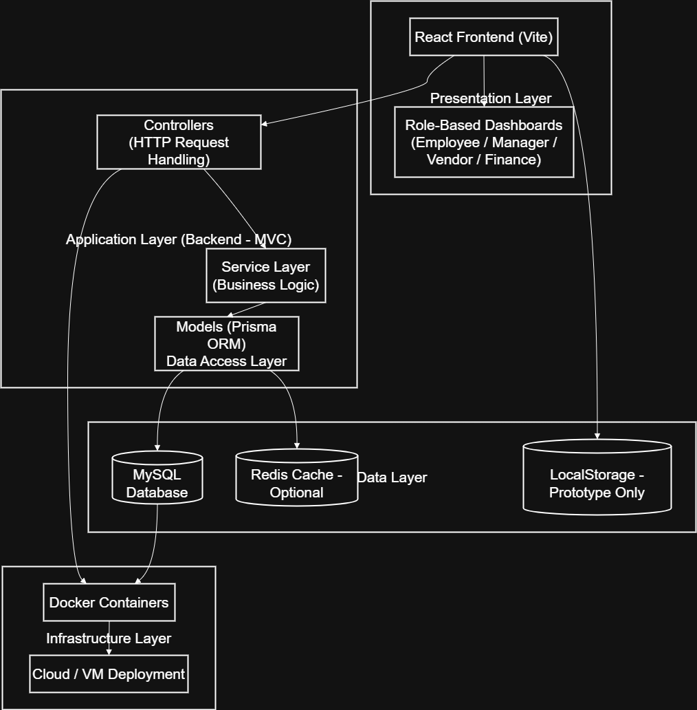

# Enterprise Procurement Management System

A role-based web application designed to digitally manage organizational procurement workflows including purchase requests, approvals, vendor selection, auctions, orders, and payments.

---

## Project Overview

The Enterprise Procurement Management System is a web-based application that models how organizations handle internal procurement processes in a structured and transparent manner.  

The system supports multiple user roles such as Employees, Managers, Vendors, and Finance users, each with clearly defined responsibilities and access controls.

This project is currently implemented as a **frontend prototype**, with backend and database layers planned for future phases.

---

## Problem Statement

In many organizations, procurement processes are manual, fragmented, and lack transparency.  
This often results in delays, poor tracking of requests, inefficient vendor selection, and payment issues.

This system aims to:
- Digitize the procurement lifecycle
- Improve traceability and accountability
- Enable structured approvals and vendor interactions
- Provide visibility across all stakeholders
=======
# E-Procurement Platform – Vision Document

## Project Name & Overview
**Project Name:** E-Procurement Platform  

This is a web-based e-procurement platform designed to digitize and streamline an organization’s internal purchasing process. The system enables employees to request items, managers to review and approve requests, vendors to fulfill orders, and finance teams to track invoice payments through a single, centralized platform.

---

## Problem It Solves
In many organizations, procurement is handled through manual processes such as emails, spreadsheets, and paper forms. These methods are time-consuming, error-prone, and lack transparency. Employees have limited visibility into request status, managers struggle to track approvals, and finance teams face difficulties reconciling orders and invoices. This project addresses these issues by providing a structured and traceable digital procurement workflow.
>>>>>>> 5b221acec4584dbf79e72c2e3f834608e2e9b99f

---

## Target Users (Personas)

### Employee
<<<<<<< HEAD
- Creates purchase requests
- Tracks request status

### Manager
- Reviews and approves requests
- Creates orders or auctions
- Assigns vendors

### Vendor
- Participates in auctions
- Fulfills assigned orders
- Submits invoices

### Finance
- Reviews invoices
- Marks payments as completed
=======
- Submits purchase requests for work-related items  
- Tracks approval and order status  
- Needs a simple and clear interface  

### Manager / Procurement Officer
- Reviews and approves purchase requests  
- Defines procurement requirements  
- Selects vendors and generates purchase orders  

### Vendor
- Receives purchase orders or auction invitations  
- Submits bids (if applicable)  
- Updates delivery status and submits invoices  

### Finance Staff
- Verifies submitted invoices  
- Updates payment status  
- Ensures financial control and record accuracy  
>>>>>>> 5b221acec4584dbf79e72c2e3f834608e2e9b99f

---

## Vision Statement
<<<<<<< HEAD

To provide a scalable, role-based digital procurement system that improves efficiency, transparency, and control over organizational purchasing workflows.

---

## Key Features and Goals

- Role-based dashboards
- Purchase request creation and tracking
- Approval workflow management
- Auction-based vendor selection
- Order lifecycle management
- Invoice verification and payment tracking
- Scalable architecture for future backend integration
=======
To provide a simple, transparent, and efficient e-procurement platform that improves control, accountability, and visibility across the entire organizational purchasing lifecycle.

---

## Key Features / Goals
- Role-based access for employees, managers, vendors, and finance staff  
- Digital purchase request creation and tracking  
- Manager approval and rejection workflow  
- Optional vendor bidding and auction support  
- Purchase order generation and order tracking  
- Invoice verification and payment status tracking  
- Clear audit trail for all procurement activities  
>>>>>>> 5b221acec4584dbf79e72c2e3f834608e2e9b99f

---

## Success Metrics
<<<<<<< HEAD

- Reduction in manual procurement steps
- Clear visibility of request and order status
- Structured vendor selection process
- Improved auditability of procurement activities

---

## Assumptions and Constraints

### Assumptions
- Users have role-based access
- Backend and database will be added in later phases

### Constraints
- Frontend-only implementation for current phase
- LocalStorage used as a mock database
- No real payment processing

---

## Architecture Overview

The system follows a layered architecture:

- **Frontend:** React + Vite
- **Backend (Planned):** Node.js + Express
- **Database (Planned):** MySQL
- **Cache (Optional):** Redis
- **Authentication:** JWT-based role access
- **Deployment:** Dockerized containers on cloud/VM

The architecture diagram is included in the `docs/` folder.

---

## Repository Structure

```text
frontend/
  ├── src/
  │   ├── pages/
  │   ├── services/
  │   ├── data/
  │   ├── components/
  │   ├── utils/
  │   └── App.jsx
  ├── Dockerfile
  └── package.json

backend/
  ├── src/
  │   ├── routes/
  │   ├── controllers/
  │   ├── services/
  │   ├── models/
  │   └── config/
  └── Dockerfile

docs/
  ├── architecture-diagram.png
  └── wireframes/
```
=======
- Employees can submit and track purchase requests without assistance  
- Managers can review and approve requests efficiently  
- Vendors can receive orders and update status correctly  
- Finance staff can verify invoices and record payments accurately  
- All procurement activities are traceable within the system  
- The project is completed within the planned schedule and scope  

---

## Assumptions & Constraints

### Assumptions
- The system is used only for internal organizational procurement  
- Users have basic familiarity with web applications  
- Vendors are willing to interact with the platform digitally  
- Human effort is assumed and not costed explicitly for this academic project  

### Constraints
- Project must be completed within a limited academic timeline  
- Only free or open-source technologies will be used  
- The system focuses on core procurement functionality and avoids unnecessary complexity  
- Security and data privacy must be maintained at a basic level  

---

# Branching Strategy

This project follows GitHub Flow.

- The `main` branch always contains stable and production-ready code
- New features are developed in separate feature branches
- Feature branches are merged back into `main` after completion

Example feature branch:
- `feature/auction-management`
  
---

# Local Development Tools

- React + Vite
- Node.js
- Docker Desktop
- Git & GitHub
- VS Code
- Figma (Wireframes)
- Draw.io (Architecture Diagram)
  
---

# Quick Start – Local Development

## Using Docker

1. Build the Docker image:
   ```docker build -t e-procurement-app frontend```
2. Run the Docker container:
   ```docker run -p 5173:5173 e-procurement-app```

---

# Architecture Overview and Design Choices

1. The system follows a Layered Client-Server Architecture (Presentation Layer, Architecture Layer, Data Layer, Infrastructure Layer) that ensures separation of concerns, maintainability and scalability.
2. MVC is applied internally within the backend to structure request handling and business logic.
3. Business logic is separated into service modules for high cohesion, and role-based dashboards minimize feature overload.

## Architecture Diagram:



See all UI screens in docs/design/UI.

